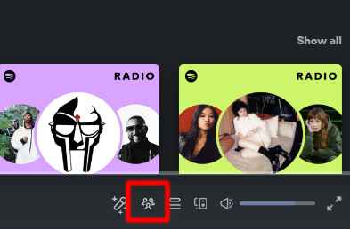

# friendActivityBottomSpicetify

felt like it needed to be more accessible, i mean all the buttons are there

**Installation**

Install Spicetify and set it up according to the instructions.
Navigate to your Spicetify config directory via the command spicetify config-dir.
Download friendACBottom.js and place it in /extensions.
Run spicetify config extensions friendACBottom.js and Spicetify apply in terminal.
